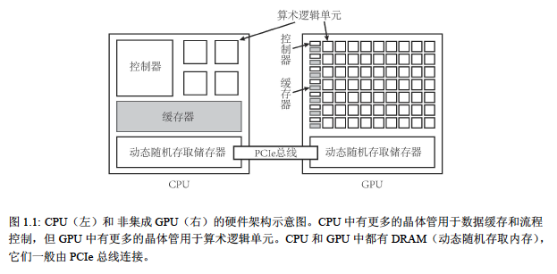
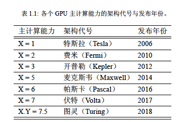
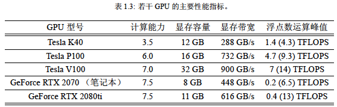
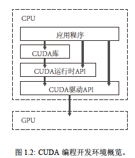
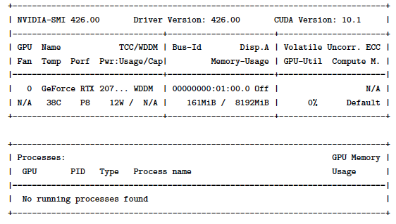

# 第1章 GPU 硬件与CUDA 程序开发工具
## 1.1 GPU硬件简介

- CPU与GPU硬件架构

<center></center>

CPU:少量计算核心，复杂控制器(分支预测，多级流水)，多级存储分级(多级缓存与DRAM)
*CPU 异构计算中的主机(host)，控制作用*
GPU:大量计算核心，多核心共享编码器/解码器(SIMT单一指令多线程思想)，多级存储分级(多级缓存与DRAM)
CPU与GPU通过PCIe总线连接
*GPU 异构计算中的设备(device)，加速作用*

- 计算能力与计算性能

计算能力:GPU硬件架构的版本，版本越大的GPU架构越新。但计算能力与计算性能并没有直接关系。

<center></center>

计算性能:
- 衡量标准(之一)

    FLOPS，又分为单精度浮点数运算峰值与双精度浮点数运算峰值
- 影响性能的参数

    GPU中的内存带宽
    
    显存容量

<center></center>

## 1.2 CUDA程序开发工具

- GPU编程的软件开发工具：
    - CUDA
    - OpenCL
    - OpenACC
本书仅讨论CUDA C++

- CUDA编程接口  

    CUDA Driver API(底层接口，灵活使用)
    
    CUDA Runtime API(运行时接口，更易使用)

- CUDA编程开发环境概览

<center></center>

CUDA:应用于异构计算的编程语言

- CUDA版本与GPU计算能力

CUDA版本:GPU软件开发平台的版本
GPU计算能力:GPU硬件架构的版本
*一个具有较高计算能力的GPU通常需要较高的CUDA版本支持*

<center></center>

## 1.3 CUDA开发环境搭建

Device: 不可直接访问
Host: C++ Compiler / CUDA Toolkit(已包含Nvidia-Driver)

## 1.4 检查与设置设备

- 基本命令

``` shell
nvidia-smi
```

<center></center>
共有若干项信息:

- GPU编号

从0开始，设置环境变量使用特定的GPU运行程序
``` shell
export CUDA_VISIBLE_DEVICES=1
```

- Name

GeForceRTX2070 
- TCC/WDDM

GPU所处模式:WDDM(Windows Display Driver Model)或TCC(Tesla Compute Cluster)模式

``` shell
sudo nvidia-smi -g GPU_ID -dm 0 # 设置为WDDM模式
sudo nvidia-smi -g GPU_ID -dm 1 # 设置为TCC模式
```

- 温度
- ECC内存
- Compute.M

计算模式，默认为Default，可允许存在多个计算进程；可设置为E.Process为独占进程模式。

``` shell
sudo nvidia-smi -i GPU_ID -c 0 # 默认模式
sudo nvidia-smi -i GPU_ID -c 1 # 独占进程模式
```

