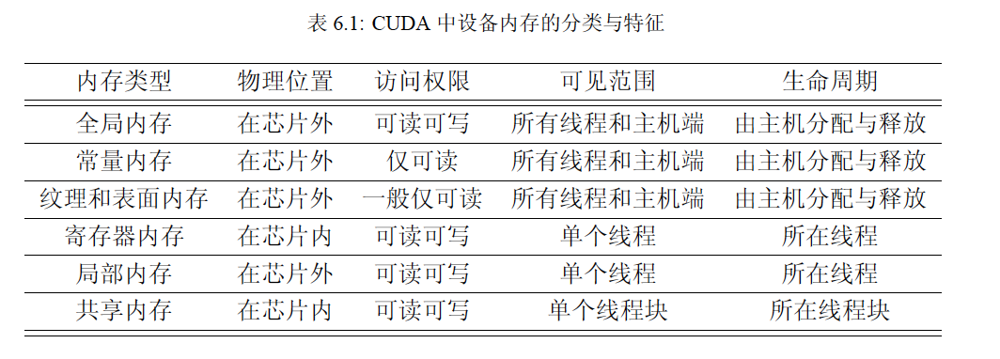
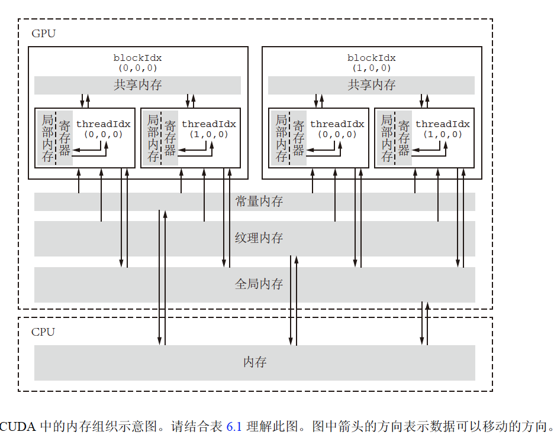

# 第6章 CUDA的内存组织

目标: 合理使用各种设备内存  

## 6.1 CUDA的内存组织简介

延迟: 处理器等待内存数据的时间  
内存: 具有分级组织结构，多种类型的内存具有不同的容量和延迟  

CPU与GPU中都存在内存分级涉及，GPU编程向程序员提供更多的内存控制权。CUDA内存分级表与图示见下方：  

<center></center>
<center></center>

## 6.2 CUDA中不同类型的内存

### 全局内存

特点: 位于片外，具有高延迟和高容量的特点 
大小: 近乎于显存   
读写权限: 所有线程可读可写  
生命周期: 由主机端决定，始于cudaMalloc，终于cudaFree。在此期间可以多次访问这些全局内存中的数据。  
全局内存: 由线性内存与CUDA Array构成，本书只讨论线性内存。 

静态全局内存变量的定义与申明

``` c++
__device__ T x; // 单变量
__device__ T y[N]; // 固定长度的数组
```

- 核函数可直接对静态全局内存变量进行访问，不需要以参数形式传给核函数  
- 不可在主机函数中直接访问静态全局变量
- 使用cudaMemcpyToSymbol和cudaMemcpyFromSymbol进行传输  

### 常量内存

大小: 64KB
读写权限: 仅可读不可写
可见范围: 同全局内存  
生命周期: 同全局内存  
特点: 具有缓存，常量内存的访问速度比全局内存高，但前提是一个线程束中的线程读取相同的常量内存数据。  

常量内存定义与声明  
``` c++
__constant__ T a;
```  

### 纹理内存和表面内存

待补充

### 寄存器

特点: 
- 1 在核函数中定义的不加任何限定符的变量一般存放在寄存器。
- 2 数组可能放于寄存器/局部内存
- 3 gridDim blockDim blockIdx threadIdx以及warpSize对应于特殊的寄存器中

### 局部内存  

待补充  

### 共享内存  

待补充  

### L1和L2缓存  

硬件实现；
可编程与不可编程  

## 6.3 SM及其占有率

### SM的构成

硬件实现

### SM的占有率

- SM中最多能拥有的线程块数
- SM中最多能拥有的线程个数

理论分析

- 无约束分析(仅由线程块大小决定)
- 寄存器资源约束
- 共享内存资源约束
